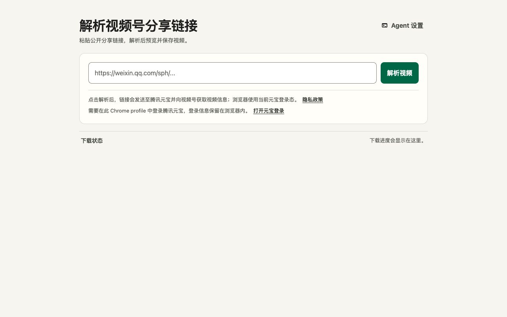
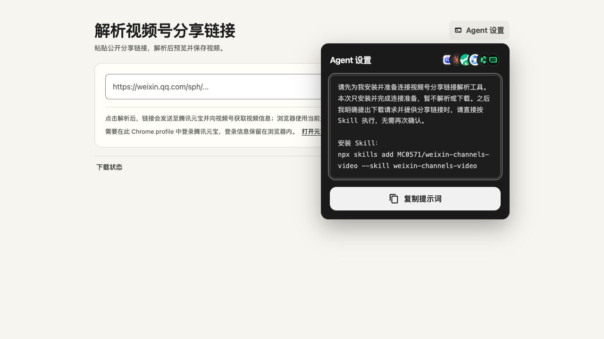

# 视频号解析与下载

把 `https://weixin.qq.com/sph/...` 视频号分享链接粘贴到 Chrome 扩展，预览视频、查看标题与作者，再选择接口提供的视频版本下载。也可以让 AI 通过 Skill 完成同样的操作。



## 选择使用方式

| 方式 | 适合谁 | 需要准备什么 |
| --- | --- | --- |
| [Chrome 扩展](#chrome-扩展) | 自己粘贴链接、预览和下载 | Chrome 116+，同一浏览器用户中登录腾讯元宝 |
| [AI Skill](#ai-skill) | 把分享链接交给 AI 下载 | macOS、Node.js 24+、Chrome 扩展及一次本地配对 |
| [自部署 API](#自部署-api) | 接入自己的应用或工作流 | Docker 或 Cloudflare，部署者自己的元宝 Cookie |

扩展与 Skill 使用浏览器中的元宝会话。Cookie 留在浏览器；扫码、验证码和登录由你完成。只下载你有权保存和使用的内容。

## Chrome 扩展

[Chrome Web Store 安装入口](https://chromewebstore.google.com/detail/jdecfnemmnhbpamcfhmgjkcphgomgjoe)（商店审核上线后可用）。审核期间，可从 [GitHub Releases](https://github.com/MC0571/weixin-channels-video/releases) 下载扩展 ZIP，解压后在 `chrome://extensions` 开启开发者模式，选择“加载已解压的扩展程序”。

1. 在安装扩展的 Chrome 用户中登录 [腾讯元宝](https://yuanbao.tencent.com/)。
2. 点击扩展图标，在打开的页面中粘贴分享链接并解析。
3. 预览视频，查看封面、标题、作者和各版本下载链接。
4. 点击所需版本下载。页面会显示完成或中断；关闭页面不会取消 Chrome 已启动的下载。

视频保存位置遵循 Chrome 下载设置，重名时自动改名。H.264、H.265 是编码名称；接口未返回的画质不会生成下载链接。

标题区的“Agent 设置”可打开完整安装提示词。复制后交给 AI，它会安装 Skill 并复用当前扩展。



## AI Skill

从本仓库安装：

```sh
npx skills add MC0571/weixin-channels-video --skill weixin-channels-video
```

也可以把 [Release](https://github.com/MC0571/weixin-channels-video/releases) 中的 Skill TAR.GZ 解压到宿主技能目录，例如 Codex 的 `~/.codex/skills/`。已有同名目录时先检查，避免覆盖自定义内容。

安装后告诉 AI：

```text
帮我下载这个视频号视频：
https://weixin.qq.com/sph/你的分享链接
```

首次使用，Skill 会准备带校验的运行资源、核实选定的 Chrome 用户和扩展，并协助注册本地桥接。安装和权限授权按实际缺失项完成；已安装且连接有效时直接复用。多个 Chrome 用户时，由你选择，不逐个尝试账号。

需要自己操作时，在安装后的 Skill 目录执行：

```sh
node scripts/run.mjs prepare
node scripts/run.mjs list-profiles
node scripts/run.mjs install-bridge \
  --extension-id '替换为当前扩展ID' --profile 'Chrome 用户名称或目录名'
node scripts/run.mjs connect
node scripts/run.mjs status
node scripts/run.mjs download --url 'https://weixin.qq.com/sph/你的分享链接'
```

商店扩展 ID 为 `jdecfnemmnhbpamcfhmgjkcphgomgjoe`。开发者模式安装的 ID 可能不同，请从当前扩展详情取得，或使用页面生成的提示词。

`prepare` 为从仓库安装的 Skill 获取最新正式 Release，验证 SHA256 和运行协议；普通命令复用本地资源，首次没有资源时自动准备。Release Skill 包已携带所需资源，可离线准备。首次下载资源需要已发布的正式 Release 和网络连接。

升级 Skill 后先执行 `prepare`，再检查 `status`。需要更新本地桥接时，使用原扩展 ID、原 Chrome 用户重新执行 `install-bridge`，保留既有配对。不要为升级重新创建 Chrome 用户或重复安装扩展。

下载默认以视频标题命名。`--filename '视频.mp4'` 可指定 Chrome 下载目录内的相对文件名。AI 会在 Chrome 确认完成后展示视频、各版本链接和最终路径。任务超时或断连后不会自动重发，避免重复下载。

连接失败时执行 `node scripts/run.mjs diagnose`。登录失效时在同一 Chrome 用户重新登录；网络检查失败不代表未登录。更多恢复步骤见 [Skill 指引](skills/weixin-channels-video/SKILL.md)。

## 自部署 API

Worker 和 Docker 提供同一个 `POST /parse` 接口，返回标题、作者、封面、预览地址和媒体链接，由调用者自行下载。服务使用部署者注入的元宝 Cookie，并以独立的 API 访问凭据保护接口。

### Docker

在仓库根目录创建 `.env`（替换示例值，不提交真实凭据）：

```dotenv
API_TOKEN=替换为随机的服务访问凭据
YUANBAO_COOKIE="替换为部署者自己的元宝Cookie"
```

```sh
chmod 600 .env
docker compose up --build -d
```

服务默认监听 3000。调用者从环境变量提供 API 凭据：

```sh
curl --fail-with-body http://localhost:3000/parse \
  -H "Authorization: Bearer $API_TOKEN" \
  -H 'Content-Type: application/json' \
  --data '{"url":"https://weixin.qq.com/sph/你的分享链接"}'
```

### Cloudflare Worker

先安装仓库依赖，在 `worker/wrangler.toml` 设置自己的 Worker 名称和账号，再通过交互式 Secret 输入配置：

```sh
npm ci
npx wrangler login
npx wrangler secret put API_TOKEN --config worker/wrangler.toml
npx wrangler secret put YUANBAO_COOKIE --config worker/wrangler.toml
npm run worker:deploy
```

输入凭据时关闭终端录制，不把 Cookie 放进命令行参数。对外服务使用 HTTPS。`API_UNAUTHORIZED` 表示 API 凭据无效，`AUTH_EXPIRED` 表示部署者的元宝会话失效。

## 使用条件与隐私

- Chrome 扩展需要有效的腾讯元宝登录；浏览器的第三方 Cookie 策略可能影响会话是否可用。
- Skill 本地桥接当前支持 macOS，需要 Node.js 24+ 和 Chrome 116+。Agent 协助安装的能力取决于宿主工具。
- 分享预览接口和媒体链接有效期由上游决定；临时媒体链接应及时使用。
- 工具按接口返回的地址直接下载，当前没有加入视频解密器。

扩展的权限、数据流和本地桥接说明见 [隐私政策](PRIVACY.md)。解析流程、组件边界、凭据处理、API 契约和构建发布方式见 [架构与维护说明](docs/architecture.md)。

## 参考项目与许可

解析流程参考 [ltaoo/wx_channels_download](https://github.com/ltaoo/wx_channels_download) 的分享链接路线，主要参考其 [Worker 解析实现](https://github.com/ltaoo/wx_channels_download/blob/main/internal/workers/sph/worker.js) 和 [Go 解析实现](https://github.com/ltaoo/wx_channels_download/blob/main/pkg/scraper/wxchannels/yuanbao.go)。

本仓库的许可见 [LICENSE](LICENSE)。参考项目采用 [MIT + Commons Clause](https://github.com/ltaoo/wx_channels_download/blob/main/LICENSE)，包含收费提供基于其功能的产品或服务的限制。若复用其代码，必须保留对应的版权与许可声明；涉及收费产品或服务时，应按其许可取得授权。
