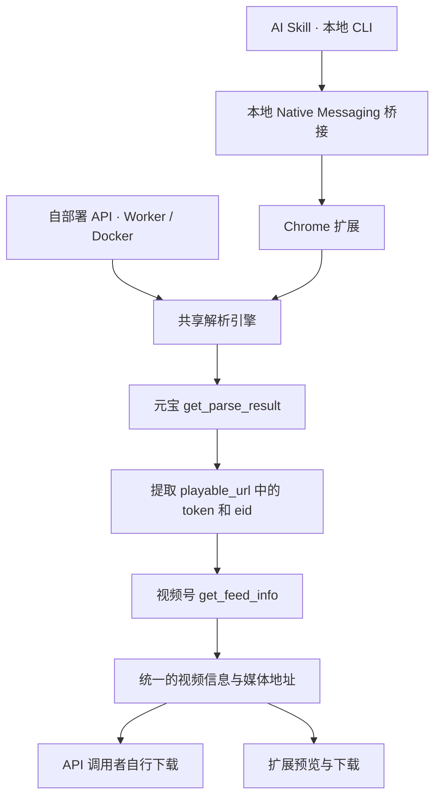

# weixin-channels-video

视频号分享链接解析与下载工具。以一个核心解析引擎，提供 AI Skill、自部署解析 API 和 Chrome 浏览器扩展三种使用入口。

输入 `https://weixin.qq.com/sph/...` 分享链接，获取视频信息、预览地址与媒体下载地址，或直接将视频保存到本地。

仓库提供共享解析核心、独立 Skill 包、Docker / Worker API 和 Manifest V3 扩展。安装方式见下文；首次真实视频解析与下载的验收进度见 [产品目标 #1](https://github.com/MC0571/weixin-channels-video/issues/1)。

## 构建与安装

开发环境需要 Node.js 24+。解析核心和 Node 服务没有运行时 npm 依赖；构建使用 esbuild，Worker 使用官方 Wrangler。

```sh
npm ci
npm test
npm run build
```

产物：

- `dist/weixin-channels-video/`：可单独复制安装的 Skill，包含本地 CLI、Native Messaging 桥接程序和 `assets/extension/` 扩展包。
- `dist/extension/`：在 `chrome://extensions` 开启开发者模式后，通过“加载已解压的扩展程序”选择此目录。
- `npm run worker:build`：单独构建 Worker 到 `dist/worker/`；这是本地打包，不会部署。

本地开发也可加载仓库的 `extension/` 目录。先运行 `npm run build`，它会从共享核心生成扩展所需的 JavaScript 文件；源码更新后再次构建，并在 `chrome://extensions` 重新加载扩展。直接加载尚未构建的源码目录会导致解析按钮无法工作。

Skill 包放到宿主的技能目录。例如 Codex 的 `~/.codex/skills/weixin-channels-video/`；已存在同名 Skill 时先检查内容，避免覆盖。Chrome 扩展点击工具栏图标后在独立标签页打开，关闭页面不会取消 Chrome 已启动的下载。

## 三种使用入口

| 入口 | 适用场景 | 解析执行位置 | 登录态来源 |
| --- | --- | --- | --- |
| AI Skill | 让 AI 根据分享链接自动解析、下载视频 | 通过本地桥接调用 Chrome 扩展 | 所选 Chrome profile 的元宝登录态 |
| 自部署 API | 为自己的应用或工作流提供解析能力 | Cloudflare Worker 或 Docker 服务 | 部署者配置的元宝 Cookie |
| Chrome 扩展 | 在浏览器中解析、预览、下载视频 | 扩展本地 | 当前 Chrome profile 的元宝登录态 |

三个入口共享解析流程、结果格式和错误语义。Skill 与 Chrome 扩展可以独立使用。

### AI Skill

将分享链接交给 AI，Skill 通过本地命令调用本项目 Chrome 扩展。插件使用用户自己的元宝登录态，执行共享核心中的解析流程，并通过 Chrome 保存视频。

```text
帮我下载这个视频号视频：
https://weixin.qq.com/sph/你的分享链接
```

```text
Agent → Skill CLI → 本地桥接 → Chrome 扩展 → 解析与下载
```

Skill 不操作元宝或视频号页面，不读取 Chrome Cookie 数据库，不需要 Python、`Chrome Safe Storage` 钥匙串授权、Docker、远程解析服务或 Codex Chrome 插件。运行要求是 macOS、本机 Chrome 和 Node.js 24+；需要 Chrome 116+，扩展所在 profile 已登录元宝。

首次使用时，Agent 检测已有安装和连接。缺少插件或桥接时，说明来源、站点访问与下载权限，以及新增的 `nativeMessaging` 权限，取得用户授权后协助安装：

1. 将独立 Skill 包放在宿主的技能目录。
2. 在选定 Chrome profile 中加载包内的 `assets/extension/`，或复用已经安装的本项目扩展。开发阶段通过 `chrome://extensions` 的“开发者模式 → 加载已解压的扩展程序”安装；Agent 有桌面操作能力时可代操作，否则提供目录和步骤。
3. 从扩展详情中取得扩展 ID，注册当前用户的本地桥接。
4. 建立连接，检查元宝登录态；未登录时由用户完成登录。

多个 profile 时使用用户已选定的 profile，或让用户选择，不遍历所有账号寻找有效登录。Chrome 的安装确认与系统授权遵循宿主工具能力；已经授权且可代操作的步骤无需重复确认。

从已安装的 Skill 目录运行：

```sh
node scripts/cli.mjs list-profiles
node scripts/cli.mjs install-bridge \
  --extension-id '替换为扩展ID' --profile 'Chrome 中的 profile 名称或目录名'
node scripts/cli.mjs connect
node scripts/cli.mjs status
node scripts/cli.mjs parse --url 'https://weixin.qq.com/sph/你的分享链接'
node scripts/cli.mjs download --url 'https://weixin.qq.com/sph/你的分享链接' \
  --filename '视频.mp4'
```

`install-bridge` 注册 Chrome 用户级 Native Messaging host 和本工具的私有配置，不修改 Chrome profile 设置或读取 Cookie。桥接目录权限为 `0700`，配置与本地 Unix socket 为 `0600`，host 仅接受已登记的扩展 ID。桥接传递固定任务和结果，不提供任意网址请求或 JavaScript 执行接口。

在插件主页面的“连接 AI 助手”区域点击开关，即可开启、关闭和重新开启连接，无需手动运行命令。默认关闭，手动解析与下载可以照常使用；首次尚未配置时，让 AI 助手协助安装本地连接组件并初始化此 profile 的连接。配对保存在该 profile 的插件内，其他 profile 不能直接使用这份连接。使用 AI 时保留主页面，关闭或刷新页面会断开连接。关闭连接不会取消已接收的任务或已开始的下载。

`connect` 复用已有连接；未连接时在所选 profile 中打开插件主页面并自动开启连接。Chrome 由此启动本地桥接，无需单独的连接页面、元宝或视频号标签页。`status` 区分未安装、未连接、已登录、未登录与登录检查失败；网络或响应异常不会被当作未登录。

`download` 默认使用共享核心选定的视频版本，`--filename` 指定 Chrome 下载目录内的相对文件名，省略时由标题生成。保存位置与位置选择遵循 Chrome 下载设置，重名时自动改名；命令等待 Chrome 报告下载完成后返回最终文件路径与字节数，中断或超时返回错误。它不支持任意绝对输出路径。

解析只在扩展中执行一次。Cookie 留在浏览器，桥接和 Agent 不接收 Cookie、钥匙串凭据或内部 `generalToken`。本地命令返回的视频媒体链接可能包含临时访问参数，应及时使用，避免把完整结果写入公共日志。

扩展的页面入口可继续独立使用；Skill 包自带同一扩展的构建产物，无需源码仓库或 npm 构建工具。桥接程序升级或安装时使用的 Node.js 可执行文件位置改变后，需要重新注册桥接。

### 自部署解析 API

提供 Cloudflare Worker 和 Docker 两种部署方式，使用同一解析引擎和同一 API 契约。

- **Cloudflare Worker**：部署轻量解析 API，通过 Worker Secret 配置元宝 Cookie 和 API 访问凭据。
- **Docker**：运行 Node.js HTTP 服务，通过受保护的配置注入元宝 Cookie 和 API 访问凭据。

部署者维护服务使用的元宝登录态。调用者提交分享链接即可解析，无需提交自己的浏览器 Cookie。元宝 Cookie 与对外 API 访问凭据分别管理。

目标接口：

```http
POST /parse
Authorization: Bearer <API 访问凭据>
Content-Type: application/json

{"url":"https://weixin.qq.com/sph/你的分享链接"}
```

返回统一的视频信息，包括标题、作者、封面、预览地址和媒体下载地址。调用者使用媒体地址自行下载；解析服务不承担视频文件存储。

Docker 在根目录创建仅自己可读的 `.env`，填入 `API_TOKEN` 与 `YUANBAO_COOKIE`，再运行：

```sh
chmod 600 .env
docker compose up --build -d
```

`.env` 格式（示例值需要替换，真实凭据不可提交）：

```dotenv
API_TOKEN=替换为随机的服务访问凭据
YUANBAO_COOKIE="替换为部署者自己的元宝Cookie"
```

服务默认监听 3000。也可不用容器，在相同环境变量下运行 `npm start`；Node.js 本身不会自动读取 `.env`，本机可使用 `node --env-file=.env server/index.mjs`。服务只能解析，不能作为任意网址代理。对外部署时通过 HTTPS 入口访问。

Worker 配置在 `worker/wrangler.toml`。修改测试 Worker 名称并选择自己的账号，用 Wrangler 的交互式 Secret 输入配置凭据：

```sh
npx wrangler login
npx wrangler secret put API_TOKEN --config worker/wrangler.toml
npx wrangler secret put YUANBAO_COOKIE --config worker/wrangler.toml
npm run worker:deploy
```

输入 Cookie 时关闭终端录制，不把它放进命令行参数。部署到 Cloudflare 与上游接受其出口请求分别验收，进度见 [#9](https://github.com/MC0571/weixin-channels-video/issues/9)。本地开发可在 `worker/.dev.vars` 中设置相同两项后执行 `npm run worker:dev`；该文件已忽略。

调用示例，API 访问凭据由调用者的环境变量提供：

```sh
curl --fail-with-body http://localhost:3000/parse \
  -H "Authorization: Bearer $API_TOKEN" \
  -H 'Content-Type: application/json' \
  --data '{"url":"https://weixin.qq.com/sph/你的分享链接"}'
```

成功响应：

```json
{"data":{"sourceUrl":"https://weixin.qq.com/sph/example","title":"视频标题","author":"作者","coverUrl":"https://media.example/cover.jpg","previewUrl":"https://media.example/video.mp4","downloadUrl":"https://media.example/video.mp4","mediaVariants":[{"label":"H.264","downloadUrl":"https://media.example/video.mp4"}]}}
```

错误响应为 `{"error":{"code":"AUTH_EXPIRED","message":"元宝登录已失效，请重新登录。"}}`。`API_UNAUTHORIZED` 表示服务访问凭据无效；`AUTH_EXPIRED` 表示部署者的元宝会话失效。两者的 HTTP 状态都是 401，由 `code` 区分。

### Chrome 浏览器扩展

在安装扩展的 Chrome profile 中登录腾讯元宝，然后：

1. 打开扩展并输入视频号分享链接。
2. 左侧查看默认视频预览及各版本下载链接，右侧查看封面、标题与作者。
3. 点击所需版本的下载链接，将视频保存到本地。

共享核心的 `mediaVariants` 收集分享接口实际返回的 H.264、通用视频地址和 H.265 版本，并按地址去重；首项是默认预览和下载版本。扩展通过视频元数据显示实际分辨率，无法识别时仍可下载该版本。编码类别不等于清晰度，接口没有返回的画质不会生成链接。

扩展直接复用浏览器会话，在本地完成解析，通过 Chrome 下载能力保存文件。无需本地后台服务，也无需部署 Worker 或 Docker。

解析时无需打开元宝或视频号上游标签页。元宝解析仍使用隐藏 iframe 和浏览器会话；浏览器按 iframe 的 SameSite 与第三方 Cookie 策略决定是否携带元宝 Cookie。受控 Chrome 测试中，未分区的 HttpOnly `SameSite=None` Cookie 随请求发送，未分区的 HttpOnly `SameSite=Strict` Cookie 未发送，因此不能保证依赖后者的登录态可用。

视频详情 API 由扩展 service worker 直接请求。扩展临时添加一条仅匹配核心生成的固定 API URL、当前扩展发起的 POST/XHR 请求的 session DNR 规则，为该请求设置视频号 `Origin` 和完整 `Referer`，完成后删除规则。请求使用核心生成的 `_rid`、`_pageUrl`、请求体和含 `token`、`eid` 的 Referer，不携带视频号 Cookie；验证消息只接受扩展自己的 `index.html` 页面，并核对 API、页面参数和请求体彼此匹配。此功能需要 Chrome 116+、`declarativeNetRequestWithHostAccess` 权限及视频号站点访问权限。扩展不读取 Cookie，也不会回退到上游标签页。当前只有本机合成响应验证，真实视频号接口是否接受这些请求头尚未验证。

扩展申请下载、`declarativeNetRequestWithHostAccess`、与本地桥接通信的 `nativeMessaging` 及访问两个上游站点所需的 host permissions。元宝登录凭据留在浏览器端，不发送给项目提供的第三方解析服务。

扩展复用 Chrome 会话发请求，没有 `cookies` 权限。默认保存到 Chrome 下载目录，重名时自动改名；位置选择遵循 Chrome 自己的下载设置。页面显示下载完成或中断。Chrome 下载 API 会按浏览器规则向媒体主机携带该主机已有的 Cookie，不能通过此 API 设置 `credentials: omit`。[Chrome 下载 API 文档](https://developer.chrome.com/docs/extensions/reference/api/downloads#method-download)

## 一个核心解析引擎



共享核心使用 JavaScript / TypeScript，负责：

- 校验分享链接并检查元宝登录态。
- 构造请求、解析响应，提取 `token` 和 `eid`。
- 获取视频详情，统一媒体地址的选择规则。
- 返回稳定的结果格式，区分未登录、内容不可用和上游请求失败。

服务与扩展负责各自的登录态、请求适配；扩展还负责交互与文件下载。Skill 负责本机安装检测、桥接配置及任务调用，复用扩展的解析与下载。解析规则只在核心中维护一次。

核心入口是 `src/core.mjs`，导出 `parseShareLink(url, { request })`、`checkLogin(request)` 和 `ParseError`。`request(url, init)` 使用 Fetch 风格返回值，认证留在请求适配器中。Node / Worker 复用 `src/cookie-request.mjs`，仅向固定元宝接口发送部署者 Cookie，并拒绝重定向。

`checkLogin` 返回 `{status: "authenticated"}` 或 `{status: "anonymous"}`，格式或网络异常抛出 `LOGIN_CHECK_FAILED`。`parseShareLink` 自行检查登录，匿名或过期返回 `AUTH_EXPIRED`。结果不包含内部 `token` / `eid`。

| 核心错误 | 含义 | API HTTP 状态 |
| --- | --- | --- |
| `INVALID_URL` | 分享链接格式不支持 | 400 |
| `AUTH_EXPIRED` | 元宝未登录或需刷新会话 | 401 |
| `LOGIN_CHECK_FAILED` | 无法可靠检查登录 | 502 |
| `FEED_UNAVAILABLE` | 内容不可用或无媒体 | 404 |
| `UPSTREAM_ERROR` | 上游 HTTP、格式或协议异常 | 502 |

账号检查使用元宝 `/api/getuserinfo`。分享链接解析使用 `/api/weixin/get_parse_result`，随后调用视频号 `/finder-preview/api/feed/get_feed_info`。视频媒体地址来自详情响应中的 `h264VideoInfo.videoUrl` 等字段。

本路线按分享预览接口返回的媒体地址直接下载。内容解析失败或下载文件无法播放时，需要返回明确错误。

本地保存检查 HTTP、非空内容和已知文本错误响应；首次真实视频还需要媒体工具或播放器确认可播放。项目没有加入未经具体媒体证明需要的解密器。

## 使用条件

- 需要有效的腾讯元宝登录态；本工具不代替用户完成扫码、验证码或系统授权。
- Skill 的桥接安装与启动当前支持 macOS；需要 Node.js、本机 Chrome 和已安装的扩展。Agent 的首次安装代操作能力取决于宿主提供的桌面工具。
- Worker 和 Docker 使用部署者提供的登录凭据，登录失效后需要更新。
- 上游接口、风控规则和媒体地址有效期可能变化。媒体地址应及时使用。

## 参考项目与许可

解析流程参考 [ltaoo/wx_channels_download](https://github.com/ltaoo/wx_channels_download) 的分享链接路线，主要参考其 [Worker 解析实现](https://github.com/ltaoo/wx_channels_download/blob/main/internal/workers/sph/worker.js) 和 [Go 解析实现](https://github.com/ltaoo/wx_channels_download/blob/main/pkg/scraper/wxchannels/yuanbao.go)。

本仓库的许可见 [LICENSE](LICENSE)。参考项目采用 [MIT + Commons Clause](https://github.com/ltaoo/wx_channels_download/blob/main/LICENSE)，包含收费提供基于其功能的产品或服务的限制。若复用其代码，必须保留对应的版权与许可声明；涉及收费产品或服务时，应按其许可取得授权。
