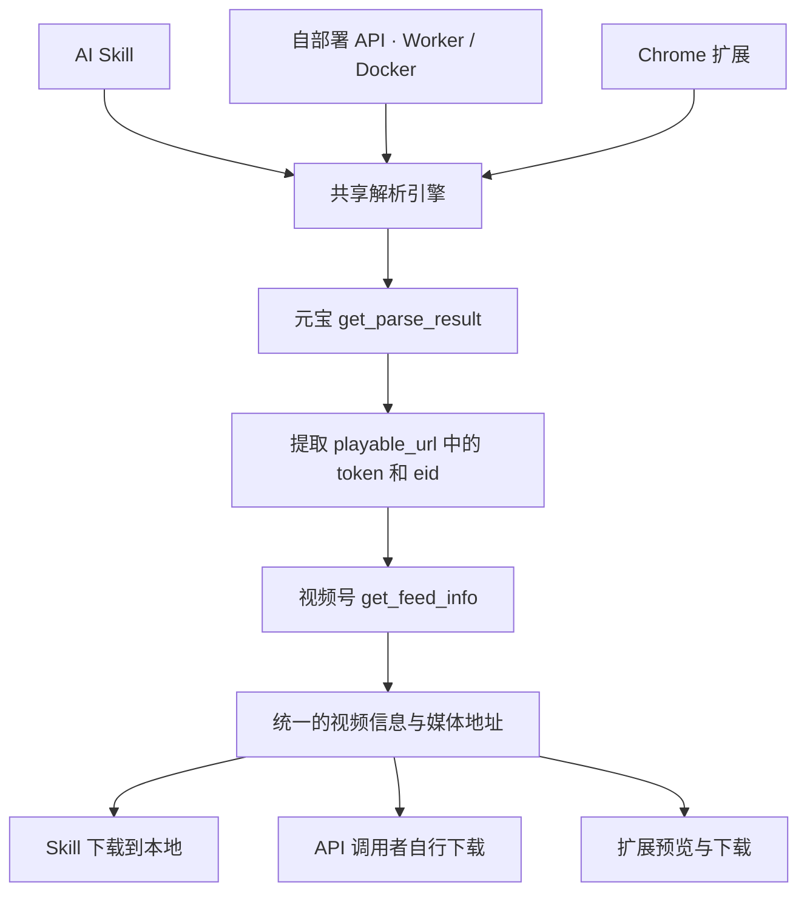

# weixin-channels-video

视频号分享链接解析与下载工具。以一个核心解析引擎，提供 AI Skill、自部署解析 API 和 Chrome 浏览器扩展三种使用入口。

输入 `https://weixin.qq.com/sph/...` 分享链接，获取视频信息、预览地址与媒体下载地址，或直接将视频保存到本地。

仓库提供共享解析核心、独立 Skill 包、Docker / Worker API 和 Manifest V3 扩展。安装方式见下文；首次真实视频解析与下载的验收进度见 [产品目标 #1](https://github.com/MC0571/weixin-channels-video/issues/1)。

## 构建与安装

开发环境需要 Node.js 24+。解析核心和 Node 服务没有运行时 npm 依赖；构建使用 esbuild，Worker 使用官方 Wrangler。

```sh
npm ci
npm test
npm run build
```

产物：

- `dist/weixin-channels-video/`：可单独复制安装的 Skill，包含本地 CLI、Python helper 和内置浏览器脚本，已带入共享核心。
- `dist/extension/`：在 `chrome://extensions` 开启开发者模式后，通过“加载已解压的扩展程序”选择此目录。
- `npm run worker:build`：单独构建 Worker 到 `dist/worker/`；这是本地打包，不会部署。

Skill 包放到宿主的技能目录。例如 Codex 的 `~/.codex/skills/weixin-channels-video/`；已存在同名 Skill 时先检查内容，避免覆盖。Chrome 扩展点击工具栏图标后在独立标签页打开，关闭页面不会取消 Chrome 已启动的下载。

## 三种使用入口

| 入口 | 适用场景 | 解析执行位置 | 登录态来源 |
| --- | --- | --- | --- |
| AI Skill | 让 AI 根据分享链接自动解析、下载视频 | 宿主内置浏览器或本地脚本 | 内置浏览器或本机 Chrome 的元宝登录态 |
| 自部署 API | 为自己的应用或工作流提供解析能力 | Cloudflare Worker 或 Docker 服务 | 部署者配置的元宝 Cookie |
| Chrome 扩展 | 在浏览器中解析、预览、下载视频 | 扩展本地 | 当前 Chrome profile 的元宝登录态 |

三个入口共享解析流程、结果格式和错误语义。Skill 与 Chrome 扩展可以独立使用。

### AI Skill

将视频号分享链接和保存位置交给 AI，Skill 自动选择当前环境中可用且已登录元宝的执行方式：

```text
帮我下载这个视频号视频，保存到 Downloads：
https://weixin.qq.com/sph/你的分享链接
```

Skill 携带共享解析代码，支持两种执行方式：

| 方式 | 请求与登录态使用方式 | 运行要求 |
| --- | --- | --- |
| 宿主内置浏览器 | 通过宿主浏览器工具发起请求，由浏览器携带自己的元宝会话 Cookie | 宿主提供浏览器工具，相关能力和权限满足请求要求 |
| 本机 Chrome | 本地脚本读取所选 profile 中适用于元宝请求的 Cookie，并发送 HTTP 请求 | 本地 Chrome、脚本运行依赖及 Cookie 读取权限 |

默认选择流程：

1. 检测当前宿主的内置浏览器能力、所需权限，以及本机 Chrome 是否存在。
2. 优先检查内置浏览器中的元宝登录态；可用且登录有效时直接使用。
3. 内置浏览器不可用或未登录时，再检查 Chrome Cookie 读取能力及元宝登录态；Chrome 登录有效时使用本地脚本。
4. 没有有效登录态时，引导用户在当前可用的优先方式中登录；没有可用执行方式时，说明缺少的能力或权限。

按优先级检查，避免在内置浏览器已满足条件时额外读取 Chrome Cookie。

用户明确指定执行方式时，按指定方式执行。网络错误、空响应或响应格式异常应报告为检查失败，不能直接判定为未登录。

确定执行方式后，Skill 使用同一解析核心获取视频信息和媒体地址，下载视频并返回本地文件位置。

以 Codex App 为例，内置浏览器使用自己的登录态，需要在其中登录元宝；页面请求无需读取 Chrome Cookie，也无需 `Chrome Safe Storage` 钥匙串授权。网站访问和必要的 CDP 权限按宿主要求授权。

本地脚本方式由 Node.js 执行共享解析代码，Python 辅助脚本负责读取 Chrome Cookie。macOS 钥匙串等系统授权由用户完成。日常使用无需手动复制 Cookie，无需 Docker、远程解析服务或 Codex Chrome 插件。

macOS Chrome 路线可直接运行：

```sh
python3 -m venv .venv
source .venv/bin/activate
python3 -m pip install -r dist/weixin-channels-video/requirements.txt
node dist/weixin-channels-video/scripts/cli.mjs list-profiles
node dist/weixin-channels-video/scripts/cli.mjs check-login --profile 'Chrome 中显示的 profile 名称'
node dist/weixin-channels-video/scripts/cli.mjs download \
  --profile 'Chrome 中显示的 profile 名称' \
  --url 'https://weixin.qq.com/sph/你的分享链接' \
  --output "$HOME/Downloads/视频.mp4"
```

依赖装到自己的 Python 环境即可，安装后的 Skill 包无需仓库或 npm 构建工具。多个 profile 时必须选择一个；可以使用列出的目录名或显示名。保存目录需已存在，目标文件已存在时返回错误并保留原文件，失败会清理本次临时文件。

Codex App 内置浏览器适配使用 `scripts/browser.js` 中的同一核心，通过两站各自标签页的 CDP 发起同源请求，再通过宿主的媒体下载能力取得本地文件。具体调用见包内 `SKILL.md`。宿主必须允许这两个来源、执行共享脚本并保存文件，才可将内置模式视为可用；当前完整内置链路仍待首次实测，[#5](https://github.com/MC0571/weixin-channels-video/issues/5) 跟踪此项。

Cookie 留在所选浏览器或本地进程中，不进入 AI 对话、日志或解析结果。登录失效时，提示用户在对应浏览器中重新登录。

### 自部署解析 API

提供 Cloudflare Worker 和 Docker 两种部署方式，使用同一解析引擎和同一 API 契约。

- **Cloudflare Worker**：部署轻量解析 API，通过 Worker Secret 配置元宝 Cookie 和 API 访问凭据。
- **Docker**：运行 Node.js HTTP 服务，通过受保护的配置注入元宝 Cookie 和 API 访问凭据。

部署者维护服务使用的元宝登录态。调用者提交分享链接即可解析，无需提交自己的浏览器 Cookie。元宝 Cookie 与对外 API 访问凭据分别管理。

目标接口：

```http
POST /parse
Authorization: Bearer <API 访问凭据>
Content-Type: application/json

{"url":"https://weixin.qq.com/sph/你的分享链接"}
```

返回统一的视频信息，包括标题、作者、封面、预览地址和媒体下载地址。调用者使用媒体地址自行下载；解析服务不承担视频文件存储。

Docker 在根目录创建仅自己可读的 `.env`，填入 `API_TOKEN` 与 `YUANBAO_COOKIE`，再运行：

```sh
chmod 600 .env
docker compose up --build -d
```

`.env` 格式（示例值需要替换，真实凭据不可提交）：

```dotenv
API_TOKEN=替换为随机的服务访问凭据
YUANBAO_COOKIE="替换为部署者自己的元宝Cookie"
```

服务默认监听 3000。也可不用容器，在相同环境变量下运行 `npm start`；Node.js 本身不会自动读取 `.env`，本机可使用 `node --env-file=.env server/index.mjs`。服务只能解析，不能作为任意网址代理。对外部署时通过 HTTPS 入口访问。

Worker 配置在 `worker/wrangler.toml`。修改测试 Worker 名称并选择自己的账号，用 Wrangler 的交互式 Secret 输入配置凭据：

```sh
npx wrangler login
npx wrangler secret put API_TOKEN --config worker/wrangler.toml
npx wrangler secret put YUANBAO_COOKIE --config worker/wrangler.toml
npm run worker:deploy
```

输入 Cookie 时关闭终端录制，不把它放进命令行参数。部署到 Cloudflare 与上游接受其出口请求分别验收，进度见 [#9](https://github.com/MC0571/weixin-channels-video/issues/9)。本地开发可在 `worker/.dev.vars` 中设置相同两项后执行 `npm run worker:dev`；该文件已忽略。

调用示例，API 访问凭据由调用者的环境变量提供：

```sh
curl --fail-with-body http://localhost:3000/parse \
  -H "Authorization: Bearer $API_TOKEN" \
  -H 'Content-Type: application/json' \
  --data '{"url":"https://weixin.qq.com/sph/你的分享链接"}'
```

成功响应：

```json
{"data":{"sourceUrl":"https://weixin.qq.com/sph/example","title":"视频标题","author":"作者","coverUrl":"https://media.example/cover.jpg","previewUrl":"https://media.example/video.mp4","downloadUrl":"https://media.example/video.mp4"}}
```

错误响应为 `{"error":{"code":"AUTH_EXPIRED","message":"元宝登录已失效，请重新登录。"}}`。`API_UNAUTHORIZED` 表示服务访问凭据无效；`AUTH_EXPIRED` 表示部署者的元宝会话失效。两者的 HTTP 状态都是 401，由 `code` 区分。

### Chrome 浏览器扩展

在安装扩展的 Chrome profile 中登录腾讯元宝，然后：

1. 打开扩展并输入视频号分享链接。
2. 查看解析得到的标题、作者、封面和视频预览。
3. 点击下载，将视频保存到本地。

扩展直接复用浏览器会话，在本地完成解析，通过 Chrome 下载能力保存文件。无需本地后台服务，也无需部署 Worker 或 Docker。

扩展仅申请功能所需的站点和下载权限。元宝登录凭据留在浏览器端，不发送给项目提供的第三方解析服务。

扩展复用 Chrome 会话发请求，没有 `cookies` 权限。默认保存到 Chrome 下载目录，重名时自动改名；位置选择遵循 Chrome 自己的下载设置。页面显示下载完成或中断。Chrome 下载 API 会按浏览器规则向媒体主机携带该主机已有的 Cookie，不能通过此 API 设置 `credentials: omit`。[Chrome 下载 API 文档](https://developer.chrome.com/docs/extensions/reference/api/downloads#method-download)

## 一个核心解析引擎



共享核心使用 JavaScript / TypeScript，负责：

- 校验分享链接并检查元宝登录态。
- 构造请求、解析响应，提取 `token` 和 `eid`。
- 获取视频详情，统一媒体地址的选择规则。
- 返回稳定的结果格式，区分未登录、内容不可用和上游请求失败。

各入口负责登录态获取、网络请求适配、用户交互和文件保存；Skill 额外负责宿主环境检测与执行方式选择。解析规则只在核心中维护一次；Skill 的两种执行方式、服务和扩展使用同一核心。

核心入口是 `src/core.mjs`，导出 `parseShareLink(url, { request })`、`checkLogin(request)` 和 `ParseError`。`request(url, init)` 使用 Fetch 风格返回值，认证留在请求适配器中。Node / Worker 复用 `src/cookie-request.mjs`，仅向固定元宝接口发送部署者 Cookie，并拒绝重定向。

`checkLogin` 返回 `{status: "authenticated"}` 或 `{status: "anonymous"}`，格式或网络异常抛出 `LOGIN_CHECK_FAILED`。`parseShareLink` 自行检查登录，匿名或过期返回 `AUTH_EXPIRED`。结果不包含内部 `token` / `eid`。

| 核心错误 | 含义 | API HTTP 状态 |
| --- | --- | --- |
| `INVALID_URL` | 分享链接格式不支持 | 400 |
| `AUTH_EXPIRED` | 元宝未登录或需刷新会话 | 401 |
| `LOGIN_CHECK_FAILED` | 无法可靠检查登录 | 502 |
| `FEED_UNAVAILABLE` | 内容不可用或无媒体 | 404 |
| `UPSTREAM_ERROR` | 上游 HTTP、格式或协议异常 | 502 |

账号检查使用元宝 `/api/getuserinfo`。分享链接解析使用 `/api/weixin/get_parse_result`，随后调用视频号 `/finder-preview/api/feed/get_feed_info`。视频媒体地址来自详情响应中的 `h264VideoInfo.videoUrl` 等字段。

本路线按分享预览接口返回的媒体地址直接下载。内容解析失败或下载文件无法播放时，需要返回明确错误。

本地保存检查 HTTP、非空内容和已知文本错误响应；首次真实视频还需要媒体工具或播放器确认可播放。项目没有加入未经具体媒体证明需要的解密器。

## 使用条件

- 需要有效的腾讯元宝登录态；本工具不代替用户完成扫码、验证码或系统授权。
- Skill 的内置浏览器方式依赖宿主提供的浏览器工具与权限；本地脚本方式依赖 Chrome Cookie 读取能力和脚本运行环境，不同操作系统的凭据存储机制需要分别适配。
- Worker 和 Docker 使用部署者提供的登录凭据，登录失效后需要更新。
- 上游接口、风控规则和媒体地址有效期可能变化。媒体地址应及时使用。

## 参考项目与许可

解析流程参考 [ltaoo/wx_channels_download](https://github.com/ltaoo/wx_channels_download) 的分享链接路线，主要参考其 [Worker 解析实现](https://github.com/ltaoo/wx_channels_download/blob/main/internal/workers/sph/worker.js) 和 [Go 解析实现](https://github.com/ltaoo/wx_channels_download/blob/main/pkg/scraper/wxchannels/yuanbao.go)。

本仓库的许可见 [LICENSE](LICENSE)。参考项目采用 [MIT + Commons Clause](https://github.com/ltaoo/wx_channels_download/blob/main/LICENSE)，包含收费提供基于其功能的产品或服务的限制。若复用其代码，必须保留对应的版权与许可声明；涉及收费产品或服务时，应按其许可取得授权。
