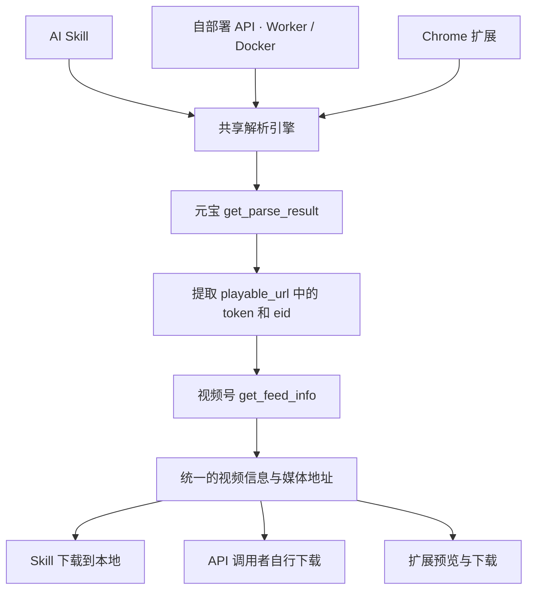

# weixin-channels-video

视频号分享链接解析与下载工具。以一个核心解析引擎，提供 AI Skill、自部署解析 API 和 Chrome 浏览器扩展三种使用入口。

输入 `https://weixin.qq.com/sph/...` 分享链接，获取视频信息、预览地址与媒体下载地址，或直接将视频保存到本地。

> 本 README 描述项目的目标产品形态。

## 三种使用入口

| 入口 | 适用场景 | 解析执行位置 | 登录态来源 |
| --- | --- | --- | --- |
| AI Skill | 让 AI 根据分享链接自动解析、下载视频 | AI 运行环境中的本地脚本 | 本机 Chrome 的元宝登录态 |
| 自部署 API | 为自己的应用或工作流提供解析能力 | Cloudflare Worker 或 Docker 服务 | 部署者配置的元宝 Cookie |
| Chrome 扩展 | 在浏览器中解析、预览、下载视频 | 扩展本地 | 当前 Chrome profile 的元宝登录态 |

三个入口共享解析流程、结果格式和错误语义。Skill 与 Chrome 扩展可以独立使用。

### AI Skill

在 Chrome 中登录腾讯元宝后，将视频号分享链接和保存位置交给 AI：

```text
帮我下载这个视频号视频，保存到 Downloads：
https://weixin.qq.com/sph/你的分享链接
```

Skill 携带解析代码，通过运行环境的本地脚本执行能力完成工作：

1. 读取所选 Chrome profile 中适用于元宝请求的 Cookie。
2. 检查登录态并解析分享链接。
3. 获取视频信息和媒体地址。
4. 下载视频，返回本地文件位置。

使用前需要准备本地运行依赖；共享解析代码由 Node.js 执行，Python 辅助脚本负责读取 Chrome Cookie。日常使用无需手动复制 Cookie，无需 Docker、远程解析服务或 Codex Chrome 插件。

Cookie 只在本地进程中使用，不进入 AI 对话、日志或解析结果。登录失效时，提示用户在 Chrome 中重新登录。macOS 钥匙串等系统授权由用户完成。

### 自部署解析 API

提供 Cloudflare Worker 和 Docker 两种部署方式，使用同一解析引擎和同一 API 契约。

- **Cloudflare Worker**：部署轻量解析 API，通过 Worker Secret 配置元宝 Cookie 和 API 访问凭据。
- **Docker**：运行 Node.js HTTP 服务，通过受保护的配置注入元宝 Cookie 和 API 访问凭据。

部署者维护服务使用的元宝登录态。调用者提交分享链接即可解析，无需提交自己的浏览器 Cookie。元宝 Cookie 与对外 API 访问凭据分别管理。

目标接口：

```http
POST /parse
Authorization: Bearer <API 访问凭据>
Content-Type: application/json

{"url":"https://weixin.qq.com/sph/你的分享链接"}
```

返回统一的视频信息，包括标题、作者、封面、预览地址和媒体下载地址。调用者使用媒体地址自行下载；解析服务不承担视频文件存储。

### Chrome 浏览器扩展

在安装扩展的 Chrome profile 中登录腾讯元宝，然后：

1. 打开扩展并输入视频号分享链接。
2. 查看解析得到的标题、作者、封面和视频预览。
3. 点击下载，将视频保存到本地。

扩展直接复用浏览器会话，在本地完成解析，通过 Chrome 下载能力保存文件。无需本地后台服务，也无需部署 Worker 或 Docker。

扩展仅申请功能所需的站点和下载权限。元宝登录凭据留在浏览器端，不发送给项目提供的第三方解析服务。

## 一个核心解析引擎



共享核心使用 JavaScript / TypeScript，负责：

- 校验分享链接并检查元宝登录态。
- 构造请求、解析响应，提取 `token` 和 `eid`。
- 获取视频详情，统一媒体地址的选择规则。
- 返回稳定的结果格式，区分未登录、内容不可用和上游请求失败。

各入口负责 Cookie 获取、运行环境的网络请求适配、用户交互和文件保存。解析规则只在核心中维护一次；Skill 随包携带核心代码，服务和扩展引用同一核心。

账号检查使用元宝 `/api/getuserinfo`。分享链接解析使用 `/api/weixin/get_parse_result`，随后调用视频号 `/finder-preview/api/feed/get_feed_info`。视频媒体地址来自详情响应中的 `h264VideoInfo.videoUrl` 等字段。

本路线按分享预览接口返回的媒体地址直接下载。内容解析失败或下载文件无法播放时，需要返回明确错误。

## 使用条件

- 需要有效的腾讯元宝登录态；本工具不代替用户完成扫码、验证码或系统授权。
- Skill 依赖本地脚本执行能力和 Chrome Cookie 读取能力；不同操作系统的凭据存储机制需要分别适配。
- Worker 和 Docker 使用部署者提供的登录凭据，登录失效后需要更新。
- 上游接口、风控规则和媒体地址有效期可能变化。媒体地址应及时使用。

## 参考项目与许可

解析流程参考 [ltaoo/wx_channels_download](https://github.com/ltaoo/wx_channels_download) 的分享链接路线，主要参考其 [Worker 解析实现](https://github.com/ltaoo/wx_channels_download/blob/main/internal/workers/sph/worker.js) 和 [Go 解析实现](https://github.com/ltaoo/wx_channels_download/blob/main/pkg/scraper/wxchannels/yuanbao.go)。

本仓库的许可见 [LICENSE](LICENSE)。参考项目采用 [MIT + Commons Clause](https://github.com/ltaoo/wx_channels_download/blob/main/LICENSE)，包含收费提供基于其功能的产品或服务的限制。若复用其代码，必须保留对应的版权与许可声明；涉及收费产品或服务时，应按其许可取得授权。
