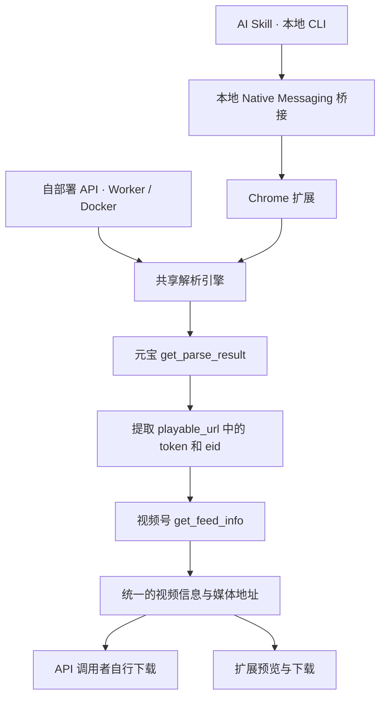

# 架构与维护说明

安装和日常使用见 [README](../README.md)，数据处理见 [隐私政策](../PRIVACY.md)。动态验收和交付状态以仓库 Issues 为准。

## 共享解析核心



共享核心使用 JavaScript / TypeScript，负责：

- 校验分享链接并检查元宝登录态。
- 构造请求、解析响应，提取 `token` 和 `eid`。
- 获取视频详情，统一媒体地址的选择规则。
- 返回稳定的结果格式，区分未登录、内容不可用和上游请求失败。

服务与扩展负责各自的登录态、请求适配；扩展还负责交互与文件下载。Skill 负责本机安装检测、桥接配置及任务调用，复用扩展的解析与下载。解析规则只在核心中维护一次。

核心入口是 `src/core.mjs`，导出 `parseShareLink(url, { request })`、`checkLogin(request)` 和 `ParseError`。`request(url, init)` 使用 Fetch 风格返回值，认证留在请求适配器中。Node / Worker 复用 `src/cookie-request.mjs`，仅向固定元宝接口发送部署者 Cookie，并拒绝重定向。

`checkLogin` 返回 `{status: "authenticated"}` 或 `{status: "anonymous"}`，格式或网络异常抛出 `LOGIN_CHECK_FAILED`。`parseShareLink` 自行检查登录，匿名或过期返回 `AUTH_EXPIRED`。结果不包含内部 `token` / `eid`。

| 核心错误 | 含义 | API HTTP 状态 |
| --- | --- | --- |
| `INVALID_URL` | 分享链接格式不支持 | 400 |
| `AUTH_EXPIRED` | 元宝未登录或需刷新会话 | 401 |
| `LOGIN_CHECK_FAILED` | 无法可靠检查登录 | 502 |
| `FEED_UNAVAILABLE` | 内容不可用或无媒体 | 404 |
| `UPSTREAM_ERROR` | 上游 HTTP、格式或协议异常 | 502 |

账号检查使用元宝 `/api/getuserinfo`。分享链接解析使用 `/api/weixin/get_parse_result`，随后调用视频号 `/finder-preview/api/feed/get_feed_info`。视频媒体地址来自详情响应中的 `h264VideoInfo.videoUrl` 等字段。

本路线按分享预览接口返回的媒体地址直接下载。内容解析失败或下载文件无法播放时，需要返回明确错误。

本地保存检查 HTTP、非空内容和已知文本错误响应；需要确认媒体有效性时，可用媒体工具或播放器检查保存文件。项目没有加入未经具体媒体证明需要的解密器。

## 扩展请求与浏览器会话

解析时无需打开元宝或视频号上游标签页。手动页面解析使用隐藏 iframe，Skill 后台解析由 offscreen 文档中的同一 iframe 请求实现承接；登录态仍由浏览器持有。浏览器按 iframe 的 SameSite 与第三方 Cookie 策略决定是否携带元宝 Cookie。受控 Chrome 测试中，未分区的 HttpOnly `SameSite=None` Cookie 随请求发送，未分区的 HttpOnly `SameSite=Strict` Cookie 未发送，因此不能保证依赖后者的登录态可用。

视频详情 API 由扩展 service worker 直接请求。扩展临时添加一条仅匹配核心生成的固定 API URL、当前扩展发起的 POST/XHR 请求的 session DNR 规则，为该请求设置视频号 `Origin` 和完整 `Referer`，完成后删除规则。请求使用核心生成的 `_rid`、`_pageUrl`、请求体和含 `token`、`eid` 的 Referer，不携带视频号 Cookie；页面消息只接受扩展自己的 `index.html`，后台 Skill 任务复用同一请求校验，核对 API、页面参数和请求体彼此匹配。此功能需要 Chrome 116+、`declarativeNetRequestWithHostAccess` 权限及视频号站点访问权限。扩展不读取 Cookie，也不会回退到上游标签页。实际 Chrome 扩展解析、预览与下载验收见 [产品目标 #10](https://github.com/MC0571/weixin-channels-video/issues/10)，Skill CLI 与 Native Messaging 下载验收见 [产品目标 #4](https://github.com/MC0571/weixin-channels-video/issues/4)。

扩展申请下载、`declarativeNetRequestWithHostAccess`、与本地桥接通信的 `nativeMessaging` 及访问两个上游站点所需的 host permissions。后台连接使用 `storage` 保存配对、连接阶段和固定错误类别，`offscreen` 承接隐藏 iframe 和旧配对迁移，`alarms` 安排受控重连；页面只读取并显示许可状态值，不显示 `runtime.lastError` 原文。页面收到 native host 的 `ready` 仅确认 host 已报告就绪；Agent 与本地桥接的 IPC 握手由 CLI 的 `status` 确认。升级时核对这些权限。元宝登录凭据留在浏览器端，不发送给项目提供的第三方解析服务。

扩展复用 Chrome 会话发请求，没有 `cookies` 权限。默认保存到 Chrome 下载目录，重名时自动改名；位置选择遵循 Chrome 自己的下载设置。页面显示下载完成或中断。Chrome 下载 API 会按浏览器规则向媒体主机携带该主机已有的 Cookie，不能通过此 API 设置 `credentials: omit`。[Chrome 下载 API 文档](https://developer.chrome.com/docs/extensions/reference/api/downloads#method-download)

## Skill 运行资源与桥接

Skill 使用外部 Node.js 运行。用户版本要求为 Node.js 22.22.2+，由 `skills/weixin-channels-video/scripts/runtime-support.mjs` 提供单一门槛；开发、测试和 Worker 构建工具可有更高要求。实际 Agent、OS、Shell、CPU 架构、运行位置、Node 安装来源与 Chrome 可达性按[Agent 安装与本地运行边界](../skills/weixin-channels-video/references/agent-installation.md)核对。Codex 用户级 Skill 目录遵循其官方 `$HOME/.agents/skills/` 路径；其他宿主使用各自官方入口，不能推广为同一 `skills` CLI 参数或默认目录。

从仓库安装的 Skill 通过 `scripts/run.mjs` 准备正式 Release 资源，验证 SHA256、归档路径和运行协议后缓存。首次普通命令缺少资源时自动准备；之后复用本地缓存。显式 `prepare` 检查最新正式 Release。Release Skill 包直接复用随包资源。源码 Skill runner 调用下载的打包 CLI，不要求克隆源码仓库或在用户侧构建；解析与下载仍由扩展执行。

`install-bridge` 注册 Chrome 用户级 Native Messaging host 和本工具的私有配置，不修改 Chrome profile 设置或读取 Cookie。macOS 使用权限为 `0700` 的用户私有目录、`0600` 配置和 Unix socket；Windows 使用由当前用户 SID 拥有并 ACL 限制给当前用户的目录/文件，以及 owner 为当前用户 SID、仅允许当前 logon SID 的单实例短生命周期命名管道。Chrome 扩展与 Native Messaging host 保持 wire v1；桥接客户端与 host 的本地 IPC 使用 v2，以保存在私有 `session.json` 中的 32-byte secret 校验带新鲜 nonce 且绑定角色和版本的 HMAC。IPC 帧不传 IPC secret 或 Chrome 配对 session ID；Windows 管道端点名由私有目录和 session ID 派生为哈希，macOS socket 文件名包含 session ID 的短前缀。Secret 不进入 Native Messaging `ready` 消息、IPC 端点名或日志。Host 仅接受已登记的扩展 ID，桥接传递固定任务和结果，不提供任意网址请求或 JavaScript 执行接口。

`bridge.json` 缺少 `ipcProtocol` 时按本地 IPC v1 处理。首次执行 v2 `install-bridge` 会自动迁移配置、轮换 IPC secret 与配对 session ID，并重新配对一次；完成后，身份相同的 v2 桥接升级保留 session ID、secret 和现有配对。Chrome 扩展侧 wire v1 不随这次本地 IPC 升级改变。

首次授权、安装和配对完成后，扩展后台自动连接本地桥接。Chrome 启动、扩展重载或连接中断后按受控退避恢复连接。配对保存在所选 profile 内，其他 profile 不能直接使用这份连接；旧页面 localStorage 配对自动迁移。页面没有 AI 连接开关，关闭、刷新或不打开插件主页均可通过 Skill 解析与下载。手动解析与下载继续独立可用。

`connect` 复用已有连接；Chrome 未运行时后台启动所选 profile 的正常 Chrome，等待扩展后台连通。首次或修复配对时可能短暂打开初始化页，配对保存后该页自行关闭，无需保留元宝、视频号或插件标签页。`parse` / `download` 在提交任务前恢复连接，提交之后不会因超时或断连自动重发，以免重复下载。`status` 报告桥接配置、连接与登录状态；网络或响应异常不会被当作未登录。

`diagnose` 只读检查 Chrome 安装、版本、运行状态、所选 profile、扩展记录、Native Messaging 注册和桥接文件、桥接使用的 Node、配对及通信状态。`runtime` 描述随包 `runtime.json` 中的版本和协议；`currentNode.version` / `currentNode.absolutePath` 描述运行 CLI 的 Node；`bridge.node` / `bridge.nodeVersion` 描述桥接配置实际使用的 Node。诊断返回 `actions` 和单项 `nextAction`；候选诊断把候选动作置于 Chrome/Node 阻断项之后、未配置桥接的泛化动作之前。未确定的原因保留为 `unknown`；普通诊断中的 `recorded_unknown` 表示已有扩展记录但无法确认启用状态；`missing_or_id_mismatch_possible` 也可能是扩展 ID 不匹配。

未注册桥接时，可用 `diagnose --profile NAME --extension-id ID` 只读核对候选 profile 和扩展 ID。两项必须同时提供，命令不读取已有桥接配置。返回的 `candidate.checkScope` 是 `chrome_profile_metadata`，`candidate.status` 为 `recorded_enabled`、`recorded_disabled` 或 `unverified`，并包含 `reason`、profile/extension 状态、`liveHandshake: not_checked` 与单项 `nextAction`。记录状态仅来自 profile 元数据，不证明扩展来源、当前加载位置或实时握手；扩展记录缺失也可能是 ID 不匹配，不能单凭连接超时认定未安装。

共享安装与恢复流程见 [Skill 指引](../skills/weixin-channels-video/SKILL.md)。宿主安装入口、OS/Node/命令能力及本地权限见 [Agent 安装说明](../skills/weixin-channels-video/references/agent-installation.md)。读取该说明并确认运行环境后再执行 Node/prepare 命令。加载扩展时使用 `prepare` 返回的 `extensionAssets` 实际绝对目录；该目录应持续保留以维持解压扩展身份。

`download` 默认使用共享核心选定的视频版本，默认文件名为 `<title>.mp4`，非法文件名字符会清理，过长标题会截短。`--filename` 指定 Chrome 下载目录内的相对文件名。保存位置与位置选择遵循 Chrome 下载设置，重名时自动改名；命令等待 Chrome 报告下载完成后返回最终文件路径、字节数及已解析的视频信息和各版本链接，中断或超时返回错误。它不支持任意绝对输出路径。

Skill 在获取链接或下载完成后嵌入视频，并列出接口实际返回的各版本下载链接；已下载时展示本地视频并给出最终文件路径。当前版本标签为 H.264 / H.265 等编码名称，没有具体码率时不猜测。展示信息复用本次结果，不再次解析或下载。

解析只在扩展中执行一次。Cookie 留在浏览器，桥接和 Agent 不接收 Cookie、钥匙串凭据或内部 `generalToken`。本地命令返回的视频媒体链接可能包含临时访问参数，应及时使用，避免把完整结果写入公共日志。

扩展的页面入口可继续独立使用；Skill 包自带同一扩展的构建产物，无需源码仓库或 npm 构建工具。桥接程序升级或安装时使用的 Node.js 可执行文件位置改变后，需要重新注册桥接。

## API 契约

```http
POST /parse
Authorization: Bearer <API 访问凭据>
Content-Type: application/json

{"url":"https://weixin.qq.com/sph/你的分享链接"}
```

返回统一的视频信息，包括标题、作者、封面、预览地址和媒体下载地址。调用者使用媒体地址自行下载；解析服务不承担视频文件存储。

```json
{"data":{"sourceUrl":"https://weixin.qq.com/sph/example","title":"视频标题","author":"作者","coverUrl":"https://media.example/cover.jpg","previewUrl":"https://media.example/video.mp4","downloadUrl":"https://media.example/video.mp4","mediaVariants":[{"label":"H.264","downloadUrl":"https://media.example/video.mp4"}]}}
```

错误响应为 `{"error":{"code":"AUTH_EXPIRED","message":"元宝登录已失效，请重新登录。"}}`。`API_UNAUTHORIZED` 表示服务访问凭据无效；`AUTH_EXPIRED` 表示部署者的元宝会话失效。两者的 HTTP 状态都是 401，由 `code` 区分。

## 构建与发布

开发环境需要 Node.js 24+。解析核心和 Node 服务没有运行时 npm 依赖；构建使用 esbuild，Worker 使用官方 Wrangler。

```sh
npm ci
npm test
npm run build
```

产物：

- `dist/weixin-channels-video/`：可单独复制安装的 Skill，包含本地 CLI、Native Messaging 桥接程序和 `assets/extension/` 扩展包。
- `dist/extension/`：在 `chrome://extensions` 开启开发者模式后，通过“加载已解压的扩展程序”选择此目录。
- `npm run worker:build`：单独构建 Worker 到 `dist/worker/`；这是本地打包，不会部署。

本地开发也可加载仓库的 `extension/` 目录。先运行 `npm run build`，它会从共享核心生成扩展所需的 JavaScript 文件；源码更新后再次构建，并在 `chrome://extensions` 重新加载扩展。直接加载尚未构建的源码目录会导致解析按钮无法工作。

Skill 包放到宿主的技能目录。例如 Codex 用户级目录为 `~/.agents/skills/weixin-channels-video/`；其他宿主的安装目录和导入方式见 [Agent 安装说明](../skills/weixin-channels-video/references/agent-installation.md)。已存在同名 Skill 时先检查内容，避免覆盖。Chrome 扩展点击工具栏图标后在独立标签页打开，关闭页面不会取消 Chrome 已启动的下载。

### 版本包与自动发布

[`Releases`](https://github.com/MC0571/weixin-channels-video/releases) 提供扩展 ZIP、独立 Skill TAR.GZ 和 `SHA256SUMS`。扩展 ZIP 解压后可通过 Chrome 开发者模式加载；Skill TAR.GZ 解压后只有一个 `weixin-channels-video/` 目录，安装与桥接步骤见 [README](../README.md#ai-skill)。

本地生成发布包需要 Node.js 24+ 和 Python 3（只使用标准库）：

```sh
npm ci
npm run release:package
```

版本来自 `extension/manifest.json`，输出到 `dist/release/`：

- `weixin-channels-video-extension-v<版本>.zip`
- `weixin-channels-video-skill-v<版本>.tar.gz`
- `SHA256SUMS`

更新版本时同步 `package.json` 和 lockfile 的包版本。合并包含 manifest 变更的提交到 main 后，Release 工作流先执行仓库检查，再创建对应提交的 GitHub Release，并将扩展上传 Chrome Web Store 送审；审核通过后自动上线。也可从 main 手动运行工作流。相同版本的 Release 只允许复用同一提交，已有资产不会被覆盖；商店拒绝或返回警告时工作流停止，由维护者检查后台后处理。

商店条目 ID 为 `jdecfnemmnhbpamcfhmgjkcphgomgjoe`；审核上线后可从 [Chrome Web Store](https://chromewebstore.google.com/detail/jdecfnemmnhbpamcfhmgjkcphgomgjoe) 安装。首次条目、截图、隐私与权限披露、测试说明及必要法律确认在商店后台完成；后续版本由 API 更新。工作流成功表示已送审或已有有效发布状态，实际上线仍以商店审核结果为准。发布期间避免在后台手动上传包。

发布使用 Google Workload Identity Federation 获取短期访问令牌，不保存服务账号密钥。仓库 Actions Variables 配置 `GCP_WIF_PROVIDER`、`CWS_SERVICE_ACCOUNT`、`CWS_PUBLISHER_ID` 和 `CWS_ITEM_ID`；Google 身份条件只允许本仓库 main 的 `.github/workflows/release.yml`，事件限定为 `push` 和 `workflow_dispatch`。令牌使用 Chrome Web Store scope。商店服务账号的权限覆盖发布者的所有条目，工作流将目标限定为上述 Item ID。

扩展及配套桥接的数据处理说明见 [隐私政策](../PRIVACY.md)。
